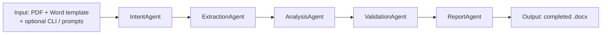

# Medical Summary Builder

An LLM-powered **sequential agent pipeline** that ingests a disability/medical case PDF and produces a completed medical summary matching a Word template. It supports custom table layouts via plain-text instructions, **local PDF extraction caching** (no re-parse when the file is unchanged), and a **Validation Agent** that checks timeline rows against the original PDF pages to reduce hallucinations.

---

## Agentic AI system architecture

**What goes in:** the claimant’s **PDF**, the **Word template** (`.docx`), and optional **CLI flags** (for example `--layout` to skip prompts). Everything rides in one shared object (`PipelineContext`) that each agent updates before handing off to the next.

**What comes out:** a **finished summary** as a `.docx` file (placeholders filled and the visit timeline written).



Analysis, Validation, and Report are the steps that call the configured chat API when the work needs model reasoning or text generation.

**What each agent does**

| Agent | What it does | How to evaluate | Trade-offs |
|-------|--------------|-----------------|------------|
| **Intent** | Talks with the user to understand whether they want the default template layout or a custom column list for the timeline table. When `--layout` is provided on the CLI it skips the prompt entirely and passes the instruction straight through. | Confirm the pipeline branches correctly to template vs custom layout mode. | Interactive prompts are user-friendly but block automation; `--layout` is the escape hatch. There is no semantic validation of the column instruction — a poorly worded value silently produces a bad table. |
| **Extraction** | Reads and parses every page of the PDF into plain text, caches the result under `cache/` keyed by SHA-256 hash so an unchanged file is never re-parsed, then measures text coverage and optionally retries with a second parser if the first yields poor results. | Check pages-with-text / total-pages ratio and compare extracted text against a manual copy. | `pdfplumber` is fast on digital PDFs but fails silently on scanned pages; `pypdfium2` fallback helps but must be installed separately. The cache never expires, so a corrected PDF must be manually cleared. |
| **Analysis** | Calls the LLM to extract structured data from the PDF text — claimant demographics, medical conditions, and a chronological visit list. Processes the document in section-aware overlapping chunks (one LLM call per F-section) so long case files don’t exceed token limits. | Compare extracted fields against a manually annotated ground truth; measure precision/recall on dates, providers, and reason text. | Chunked calls improve recall on long documents but multiply API cost and latency; the `(date, provider)` deduplication heuristic can merge two distinct visits at the same facility on the same day. |
| **Validation** | Fact-checks each extracted visit against the original PDF page it claims to come from. Fast fuzzy matching screens every row at zero LLM cost; only rows that fail are sent to the LLM in proximity-grouped batches for correction or removal. | Measure true positives (hallucinated rows caught), false negatives (hallucinations that pass), and false positives (legitimate rows wrongly removed). | The fuzzy threshold (60) is permissive to avoid dropping valid rows, which lets subtle hallucinations slip through; batching by page proximity cuts API cost but means one bad LLM response can affect several rows at once. |
| **Report** | Fills the Word template with all extracted data — substituting every `{{PLACEHOLDER}}` token and writing the chronologically sorted timeline table — or generates a fully custom-layout document when the user requested one; falls back to the default template if the custom-layout LLM call fails. | Check that no `{{PLACEHOLDER}}` tokens survive in the output, verify table row order and ref formatting (`Pg N`), and confirm the `Last Updated` field is correct. | `python-docx` preserves template styles precisely but offers limited layout flexibility; custom-layout mode delegates formatting to the LLM, making output non-deterministic. The silent fallback on LLM error is safe but can surprise users who expected a custom layout. |
---

## Project structure

```
medical_summary_builder/
├── README.md
├── pyproject.toml
├── LESSONS_LEARNED.md
├── cache/                        # PDF extraction cache (SHA256-keyed JSON)
├── data/
│   └── Medical File.pdf          # Source claimant record (PDF)
├── docs/
│   └── summary_template.docx     # Word template used by the pipeline
├── src/
│   └── medical_summary_builder/
│       ├── __init__.py
│       ├── main.py               # CLI: builds Pipeline + PipelineContext
│       ├── pipeline.py           # PipelineContext, PDFDocument, ClaimantInfo, Pipeline
│       ├── cache.py              # load_cache / save_cache
│       └── agents/
│           ├── base.py           # BaseAgent
│           ├── intent_agent.py
│           ├── extraction_agent.py
│           ├── analysis_agent.py
│           ├── validation_agent.py
│           └── report_agent.py
├── output/                       # Generated reports
└── tests/
```

---

## Prerequisites

### Install uv

`uv` is a fast Python package and project manager. Install it with:

**Windows (PowerShell):**
```powershell
powershell -ExecutionPolicy ByPass -c "irm https://astral.sh/uv/install.ps1 | iex"
```

**macOS / Linux:**
```bash
curl -LsSf https://astral.sh/uv/install.sh | sh
```

After installation, restart your terminal and verify:
```bash
uv --version
```

> Official docs: https://docs.astral.sh/uv/

---

## Setup

### 1. Enter the project

```bash
cd medical_summary_builder
```

### 2. Create the virtual environment and install dependencies

```bash
uv sync
```

This reads `pyproject.toml`, creates a `.venv` folder, and installs all required packages.

### 3. Configure AI Builders Space

Copy the example environment file and add your token:

```bash
cp .env.example .env
```

Edit `.env`:

```
AI_BUILDER_TOKEN=sk_...
DEFAULT_MODEL=gpt-5
```

The app calls the OpenAI-compatible endpoint at `https://space.ai-builders.com/backend/v1` using this token.

---

## Usage

### Template format requirements

The Word template (`docs/summary_template.docx`) uses `RE:` and `Title:` header labels and embeds impairments in the summary body (no standalone "Impairments:" line). It must use `{{PLACEHOLDER}}` tokens for field substitution and have column headers in the first row of the timeline table:

| Location | Required content |
|----------|-----------------|
| Name/SSN paragraph | `{{NAME}}`, `{{SSN}}`, `{{TITLE}}`, `{{DLI}}` — uses `RE:` and `Title:` labels |
| AOD paragraph | `{{AOD}}`, `{{DOB}}`, `{{AGE_AT_AOD}}`, `{{CURRENT_AGE}}` |
| Grade paragraph | `{{LAST_GRADE}}`, `{{SPECIAL_ED}}` — uses `Attended Special Ed Classes:` label |
| Last updated paragraph | `{{LAST_UPDATED}}` (pipeline appends `– COMPLETED THROUGH <section>` automatically) |
| Table row 0 cells | `DATE`, `PROVIDER`, `REASON`, `REF` |

---

### Basic — default template (interactive intent prompt)

If you omit `--layout`, the **Intent Agent** asks whether you want custom table columns or the default template.

**PowerShell (Windows):**
```powershell
uv run python -m medical_summary_builder.main `
  --pdf "data/Medical File.pdf" `
  --template "docs/summary_template.docx" `
  --output "output/summary.docx"
```

**bash (macOS / Linux / Git Bash):**
```bash
uv run python -m medical_summary_builder.main \
  --pdf "data/Medical File.pdf" \
  --template "docs/summary_template.docx" \
  --output "output/summary.docx"
```

### Skip prompts — custom columns from the CLI

**PowerShell (Windows):**
```powershell
uv run python -m medical_summary_builder.main `
  --pdf "data/Medical File.pdf" `
  --template "docs/summary_template.docx" `
  --output "output/summary_custom.docx" `
  --layout "Date, Facility, Physician, Summary, Ref"
```

**bash (macOS / Linux / Git Bash):**
```bash
uv run python -m medical_summary_builder.main \
  --pdf "data/Medical File.pdf" \
  --template "docs/summary_template.docx" \
  --output "output/summary_custom.docx" \
  --layout "Date, Facility, Physician, Summary, Ref"
```

### Choose a different model

**PowerShell (Windows):**
```powershell
uv run python -m medical_summary_builder.main `
  --pdf "data/Medical File.pdf" `
  --template "docs/summary_template.docx" `
  --model gemini-2.5-pro
```

**bash (macOS / Linux / Git Bash):**
```bash
uv run python -m medical_summary_builder.main \
  --pdf "data/Medical File.pdf" \
  --template "docs/summary_template.docx" \
  --model gemini-2.5-pro
```

### CLI options

| Flag | Description | Default |
|------|-------------|---------|
| `--pdf` | Path to input PDF | required |
| `--template` | Path to `.docx` template | required |
| `--output` | Path for output `.docx` | `output/summary.docx` |
| `--layout` | Custom column list or instruction; skips interactive intent | None (prompt or template) |
| `--model` | AI Builders Space model name | `gpt-5` (or `DEFAULT_MODEL` in `.env`) |

Example models: `grok-4-fast`, `gemini-2.5-pro`, `gemini-3-flash-preview`, `deepseek`, `gpt-5`, `kimi-k2.5`.

---

## How it works (step by step)

1. **Intent** — Decides template vs custom table layout (CLI `--layout` or Rich prompts).
2. **Extraction** — Loads from `cache/<sha8>_<stem>.json` (under the project root) when the PDF bytes match; otherwise extracts with `pdfplumber`, measures quality (pages with sufficient text), optionally retries with `pypdfium2` (optional dependency — `uv add pypdfium2`), then saves cache.
3. **Analysis** — Chunked extraction: demographics from the first 30 pages, then auto-detects F-section boundaries using three cover-page patterns (standard SSA `1 of N: NF:`, no-colon `1 of N NF:`, and keyword `Exhibit NF`). Each section is split into overlapping chunks of at most **10 pages or 32 000 chars (~8 K tokens)** — whichever limit is hit first — with a 2-page overlap to avoid missing events at boundaries. Each chunk calls the LLM with the section's facility name and treatment date range as context anchors. Events are merged, deduplicated by `(date, provider)`, and sorted using proper MM/DD/YYYY date parsing. Falls back to a single full-document call if no F-section markers are found. Sets `completion_through` (e.g. `"F"`) and stores section boundaries in `medical_sections` on the context. `current_age` is always calculated from the claimant's date of birth (not read from the document) so it reflects today's date precisely.
4. **Validation** — `rapidfuzz` checks each event against its cited page; failures are **batched by page proximity** (events whose ±3-page windows overlap share a single LLM call) to reduce API round-trips. Each batch call returns corrected events or `REMOVE` decisions; markdown fences in the LLM response are stripped before parsing. Unsupported rows are dropped.
5. **Report** — `python-docx` fills template placeholders and the timeline table, or generates a custom-layout document. If the custom-layout LLM call fails, the output gracefully falls back to the default Word template. The `Last Updated` field automatically appends `– COMPLETED THROUGH <section>`. The duplicate text-paragraph column header is suppressed (the table already has a header row). Each event's PDF page ref is converted to its exhibit size ref (`Pg N` where N = total pages of that F-section), with overlap resolved by preferring the latest-starting section. Events are re-sorted chronologically using proper date parsing before writing. In custom-layout mode the "MEDICAL SUMMARY" title matches the template style (normal paragraph, centered, bold, underlined, Times New Roman); the layout instruction line is not written to the output document.

---

## Development

Run tests:

```bash
uv run pytest
```

Add a dependency:

```bash
uv add <package-name>
```

---

## Lessons learned

Failures and design notes are recorded in [LESSONS_LEARNED.md](LESSONS_LEARNED.md).
